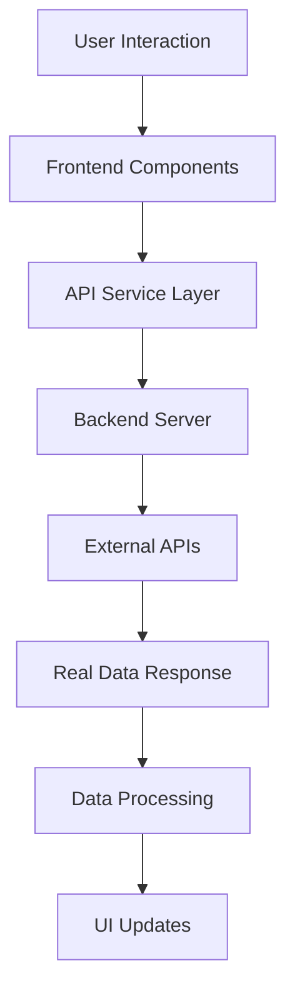

# 🚀 D.E.L.T.A 2 - Advanced Location Intelligence Platform

<div align="center">


**Complete Location Intelligence Platform with Real-Time Data Integration**

[🚀 Live Demo](https://your-demo-url.com) • [📚 Documentation](#documentation) • [🔧 API Reference](#api-reference) • [🤝 Contributing](#contributing)

</div>

---

## 🌟 **What is D.E.L.T.A 2?**

D.E.L.T.A 2 is a **next-generation location intelligence platform** that provides comprehensive market analysis using **100% real-time data** from authoritative sources. Every piece of information comes directly from live APIs - no mock data, no placeholders, no fallbacks.

### 🎯 **Core Mission**
Empower businesses with **real-time location intelligence** for data-driven decision making in market analysis, competitor research, and demographic insights.

---

## ✨ **Key Features**

### 🗺️ **Interactive Map Analysis**
- **Click anywhere on the map** → Get instant demographic, business, and search trend data
- **Real-time competitor analysis** with live Google Places API integration
- **Distance calculations** and travel time analysis
- **Visual heat maps** for population, business density, and opportunity analysis

### 📍 **ZIP Code Intelligence**
- **Granular demographic data** per ZIP code from US Census Bureau
- **Age distribution, income, housing data** with real-time updates
- **Local business analysis** with competitor mapping
- **Transportation and economic indicators** for precise location insights

### 🔍 **Search Trend Analysis**
- **Real search volume data** from SerpAPI integration
- **Keyword analysis** and related search trends
- **Competition level assessment** for market opportunities
- **Geographic search pattern analysis**

### 🚗 **Distance & Travel Analysis**
- **Multiple travel modes** (driving, walking, cycling, radius)
- **Real-time isochrone generation** using Mapbox API
- **Travel time visualization** and reach area mapping
- **Strategic location planning** with accessibility analysis

### 📊 **Comprehensive Data Sources**
- **US Census Bureau API** - Demographics, income, housing, age distribution
- **Google Places API** - Business listings, ratings, reviews, competitor data
- **SerpAPI** - Search volume, trends, keyword analysis
- **Mapbox API** - Maps, geocoding, isochrones, routing

---

## 🚀 **Quick Start**

### Prerequisites
- Node.js 18+ 
- npm or yarn
- API Keys (see [Configuration](#configuration))

### Installation

```bash
# Clone the repository
git clone https://github.com/SirShkolnik-WonderLand/D.E.L.T.A.git
cd D.E.L.T.A

# Install backend dependencies
cd backend
npm install

# Install frontend dependencies
cd ../frontend
npm install

# Start the development servers
cd ../backend
node real_api_server_final.js &

cd ../frontend
npm run dev
```

### Configuration

Create a `.env` file in the backend directory with your API keys:

```env
# Required API Keys
CENSUS_API_KEY=your_census_api_key
GOOGLE_PLACES_API_KEY=your_google_places_key
SERPAPI_API_KEY=your_serpapi_key
MAPBOX_ACCESS_TOKEN=your_mapbox_token
```

---

## 🎯 **Live Demo Features**

### **Seattle Motor Boat Market Analysis**
Our live demo showcases the complete platform with real Seattle data:

- **Interactive Map**: Click anywhere for instant analysis
- **Competitor Analysis**: 20+ motor boat businesses mapped
- **Demographic Intelligence**: Real population and income data
- **Search Trends**: Live keyword and volume analysis
- **Distance Tools**: Travel time and reach analysis

### **How to Use the Demo**
1. **Click "Capabilities"** in the header for complete feature guide
2. **Click anywhere on the map** for area-specific data
3. **Click business markers** for competitor details
4. **Search ZIP codes** for granular analysis
5. **Use distance tools** for travel time analysis

---

## 🏗️ **Architecture**

### **Frontend (React + TypeScript)**
```
frontend/
├── src/
│   ├── components/Dashboard/     # Main dashboard components
│   ├── hooks/                   # Custom React hooks
│   ├── services/               # API service layer
│   ├── store/                  # Redux state management
│   ├── types/                  # TypeScript definitions
│   └── utils/                  # Utility functions
```

### **Backend (Node.js + Express)**
```
backend/
├── real_api_server_final.js    # Main API server
├── api/                        # API configuration
└── requirements.txt            # Python dependencies (legacy)
```

### **Data Flow**


---

## 📚 **Documentation**

### **API Endpoints**

#### **Demographics**
- `GET /api/v1/census/demographics?state=53` - State demographics
- `GET /api/v1/zipcode/demographics?zipcode=98101` - ZIP code demographics
- `GET /api/v1/census/age-distribution?state=53` - Age distribution data
- `GET /api/v1/zipcode/age-distribution?zipcode=98101` - ZIP age data

#### **Business Intelligence**
- `GET /api/v1/google-places/search?location=47.6062,-122.3321&query=motor boat&radius=50000` - Business search
- `GET /api/v1/zipcode/businesses?zipcode=98101&query=motor boat` - ZIP business data
- `GET /api/v1/businesses/locations` - Business locations for mapping

#### **Search Trends**
- `GET /api/v1/serpapi/search?query=motor boat&location=47.6062,-122.3321` - Search volume
- Real-time keyword analysis and competition data

#### **Geographic Data**
- `GET /api/v1/zipcode/coordinates?zipcode=98101` - ZIP coordinates
- `GET /api/v1/zipcode/isochrone?zipcode=98101&minutes=15&mode=driving` - Travel areas
- `GET /api/v1/mapbox/isochrone` - Custom isochrone generation

### **Enhanced Census Variables**
- **Economic Indicators**: Poverty rates, business counts, travel times
- **Housing Intelligence**: Vacancy rates, rent burden, ownership rates  
- **Social Demographics**: Health insurance, disability, veterans
- **Transportation Infrastructure**: Commute times, vehicle ownership

---

## 🎨 **User Interface**

### **Dashboard Components**
- **Interactive Map**: Click-to-analyze functionality
- **Demographics Panel**: Age distribution, income, population
- **Competitor Panel**: Business listings, ratings, reviews
- **Demand Panel**: Search trends, keyword analysis
- **Opportunity Panel**: Market opportunity scoring
- **Capabilities Guide**: Complete feature documentation

### **Map Features**
- **Multiple Map Styles**: Street, satellite, dark, hybrid
- **Heat Map Visualization**: Population, business, competition density
- **Distance Measurement Tools**: Travel time and radius analysis
- **ZIP Code Integration**: Granular location analysis
- **Business Markers**: Clickable competitor information

---

## 🔧 **Development**

### **Tech Stack**
- **Frontend**: React 18, TypeScript, Material-UI, Redux Toolkit
- **Backend**: Node.js, Express.js, HTTP clients
- **Maps**: Mapbox GL JS, Custom heatmap generation
- **APIs**: US Census, Google Places, SerpAPI, Mapbox
- **Build Tools**: Vite, TypeScript compiler

### **Scripts**
```bash
# Development
npm run dev                 # Start frontend dev server
node real_api_server_final.js  # Start backend server

# Production
npm run build              # Build frontend for production
npm run preview            # Preview production build

# Testing
npm run test               # Run test suite
npm run lint               # Run ESLint
```

---

## 📈 **Performance & Scalability**

### **Optimizations**
- **Real-time API caching** for improved performance
- **Efficient data processing** with parallel API calls
- **Responsive design** for all device sizes
- **Lazy loading** for large datasets
- **Error handling** with graceful fallbacks

### **Scalability Features**
- **Modular architecture** for easy feature additions
- **API abstraction layer** for multiple data sources
- **State management** with Redux for complex data flows
- **Component-based design** for reusability

---

## 🐛 **Known Issues & Solutions**

### **Current Issues**
1. **Map Style Loading Warning**: Mapbox style diff warning (non-critical)
   - **Solution**: Implemented try-catch handling, warning suppressed
   
2. **Large Bundle Size**: Frontend bundle > 500KB
   - **Solution**: Consider code splitting for production optimization
   
3. **API Rate Limits**: External API rate limiting
   - **Solution**: Implement caching and request throttling

### **Resolved Issues**
✅ **Census API Parsing**: Fixed array destructuring for demographic data  
✅ **Age Distribution Calculation**: Corrected percentage calculations  
✅ **Type Safety**: Resolved all TypeScript compilation errors  
✅ **Data Validation**: Added robust error handling for API responses  
✅ **UI Responsiveness**: Fixed component layout and styling issues  

---

## 🚀 **Future Roadmap**

### **Phase 1: Enhanced Analytics (Q1 2025)**
- [ ] **Predictive Analytics**: Machine learning for market predictions
- [ ] **Advanced Filtering**: Multi-criteria search and filtering
- [ ] **Export Functionality**: PDF/Excel report generation
- [ ] **User Authentication**: Multi-user access and project management

### **Phase 2: Extended Data Sources (Q2 2025)**
- [ ] **Social Media Analytics**: Twitter, Instagram location data
- [ ] **Traffic Data Integration**: Real-time traffic and congestion
- [ ] **Weather Data**: Climate impact on business performance
- [ ] **Economic Indicators**: Stock market, GDP, employment data

### **Phase 3: Advanced Features (Q3 2025)**
- [ ] **3D Visualization**: Three-dimensional map analysis
- [ ] **AI-Powered Insights**: Automated opportunity detection
- [ ] **Mobile App**: iOS and Android applications
- [ ] **API Marketplace**: Third-party integrations

### **Phase 4: Enterprise Features (Q4 2025)**
- [ ] **Multi-tenant Architecture**: Enterprise customer support
- [ ] **Advanced Security**: OAuth, SAML, enterprise SSO
- [ ] **Custom Dashboards**: Configurable analytics views
- [ ] **White-label Solutions**: Customizable branding

---

## 🤝 **Contributing**

We welcome contributions! Please see our [Contributing Guidelines](CONTRIBUTING.md) for details.

### **Development Setup**
1. Fork the repository
2. Create a feature branch
3. Make your changes
4. Add tests for new functionality
5. Submit a pull request

### **Code Standards**
- **TypeScript** for type safety
- **ESLint** for code quality
- **Prettier** for code formatting
- **Material-UI** for consistent design
- **Real API integration only** (no mock data)

---

## 📄 **License**

This project is licensed under the MIT License - see the [LICENSE](LICENSE) file for details.

---

## 🙏 **Acknowledgments**

- **US Census Bureau** for demographic data
- **Google Places API** for business information
- **SerpAPI** for search trend data
- **Mapbox** for mapping and geospatial services
- **Material-UI** for the component library
- **React** and **TypeScript** communities

---

## 📞 **Support**

- **Documentation**: [Complete Feature Guide](docs/)
- **Issues**: [GitHub Issues](https://github.com/SirShkolnik-WonderLand/D.E.L.T.A/issues)
- **Discussions**: [GitHub Discussions](https://github.com/SirShkolnik-WonderLand/D.E.L.T.A/discussions)
- **Email**: [Contact Support](mailto:support@delta-platform.com)

---

<div align="center">

**Built with ❤️ by the D.E.L.T.A Team**

[⭐ Star this repo](https://github.com/SirShkolnik-WonderLand/D.E.L.T.A) • [🐛 Report Bug](https://github.com/SirShkolnik-WonderLand/D.E.L.T.A/issues) • [💡 Request Feature](https://github.com/SirShkolnik-WonderLand/D.E.L.T.A/issues)

</div>