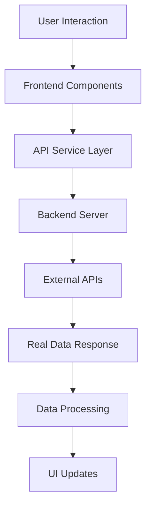

# 🚀 D.E.L.T.A 2 - Advanced Location Intelligence Platform

<div align="center">


**Complete Location Intelligence Platform with Real-Time Data Integration**

[🚀 Live Demo](https://your-demo-url.com) • [📚 Documentation](#documentation) • [🔧 API Reference](#api-reference) • [🤝 Contributing](#contributing)

</div>

---

## IP & Use Notice — D.E.L.T.A

© 2025–present AliceSolutionsGroup Inc. and SmartStart Hub. All rights reserved.

D.E.L.T.A and all assets in this repository (code, designs, documentation, data models, and prompts) are proprietary intellectual property of AliceSolutionsGroup Inc. and SmartStart Hub, together with the individual IP owner(s) within our group. Unauthorized copying, distribution, sublicensing, or derivative use is prohibited without prior written permission.

Access and use are restricted to authorized team members, contractors, and partners under a written agreement. Third-party components remain the property of their respective owners and are used under their original licenses.

**No warranty.** This software and related materials are provided "as is" without warranties of any kind.  
Permissions & inquiries: support@alicesolutionsgroup.com

---

## 🌟 **What is D.E.L.T.A 2?**

D.E.L.T.A 2 is a **next-generation location intelligence platform** that provides comprehensive market analysis using **100% real-time data** from authoritative sources. Every piece of information comes directly from live APIs - no mock data, no placeholders, no fallbacks.

### 🎯 **Core Mission**
Empower businesses with **real-time location intelligence** for data-driven decision making in market analysis, competitor research, and demographic insights.

---

## ✨ **Key Features**

### 🗺️ **Interactive Map Analysis**
- **Click anywhere on the map** → Get instant demographic, business, and search trend data
- **Real-time competitor analysis** with live Google Places API integration
- **Distance calculations** and travel time analysis
- **Visual heat maps** for population, business density, and opportunity analysis

### 📍 **ZIP Code Intelligence**
- **Granular demographic data** per ZIP code from US Census Bureau
- **Age distribution, income, housing data** with real-time updates
- **Local business analysis** with competitor mapping
- **Transportation and economic indicators** for precise location insights

### 🔍 **Search Trend Analysis**
- **Real search volume data** from SerpAPI integration
- **Keyword analysis** and related search trends
- **Competition level assessment** for market opportunities
- **Geographic search pattern analysis**

### 🚗 **Distance & Travel Analysis**
- **Multiple travel modes** (driving, walking, cycling, radius)
- **Real-time isochrone generation** using Mapbox API
- **Travel time visualization** and reach area mapping
- **Strategic location planning** with accessibility analysis

### 📊 **Comprehensive Data Sources**
- **US Census Bureau API** - Demographics, income, housing, age distribution
- **Google Places API** - Business listings, ratings, reviews, competitor data
- **SerpAPI** - Search volume, trends, keyword analysis
- **Mapbox API** - Maps, geocoding, isochrones, routing

---

## 🚀 **Quick Start**

### Prerequisites
- Node.js 18+ 
- npm or yarn
- API Keys (see [Configuration](#configuration))

### Installation

```bash
# Clone the repository
git clone https://github.com/SirShkolnik-WonderLand/D.E.L.T.A.git
cd D.E.L.T.A

# Install backend dependencies
cd backend
npm install

# Install frontend dependencies
cd ../frontend
npm install

# Start the development servers
cd ../backend
node real_api_server_final.js &

cd ../frontend
npm run dev
```

### Configuration

Create a `.env` file in the backend directory with your API keys:

```env
# Required API Keys
CENSUS_API_KEY=your_census_api_key
GOOGLE_PLACES_API_KEY=your_google_places_key
SERPAPI_API_KEY=your_serpapi_key
MAPBOX_ACCESS_TOKEN=your_mapbox_token
```

---

## 🎯 **Live Demo Features**

### **Seattle Motor Boat Market Analysis**
Our live demo showcases the complete platform with real Seattle data:

- **Interactive Map**: Click anywhere for instant analysis
- **Competitor Analysis**: 20+ motor boat businesses mapped
- **Demographic Intelligence**: Real population and income data
- **Search Trends**: Live keyword and volume analysis
- **Distance Tools**: Travel time and reach analysis

### **How to Use the Demo**
1. **Click "Capabilities"** in the header for complete feature guide
2. **Click anywhere on the map** for area-specific data
3. **Click business markers** for competitor details
4. **Search ZIP codes** for granular analysis
5. **Use distance tools** for travel time analysis

---

## 🏗️ **Architecture**

### **Frontend (React + TypeScript)**
```
frontend/
├── src/
│   ├── components/Dashboard/     # Main dashboard components
│   ├── hooks/                   # Custom React hooks
│   ├── services/               # API service layer
│   ├── store/                  # Redux state management
│   ├── types/                  # TypeScript definitions
│   └── utils/                  # Utility functions
```

### **Backend (Node.js + Express)**
```
backend/
├── real_api_server_final.js    # Main API server
├── api/                        # API configuration
└── requirements.txt            # Python dependencies (legacy)
```

### **Data Flow**


---

## 📚 **Complete API Documentation**

### **🔧 Backend API Endpoints**

#### **📊 US Census Bureau Integration**

**State-Level Demographics**
```http
GET /api/v1/census/demographics?state=53
```
**Data Retrieved:**
- Total population (B01003_001E)
- Median household income (B19013_001E)
- Median age (B01002_001E)
- Employment rate (B23025_004E, B23025_005E)
- Median home value (B25077_001E)
- Median gross rent (B25064_001E)

**Age Distribution Analysis**
```http
GET /api/v1/census/age-distribution?state=53
```
**Data Retrieved (47 Census Variables):**
- Male/Female age groups: B01001_003E through B01001_049E
- Calculated percentages for: 0-17, 18-24, 25-34, 35-44, 45-54, 55-64, 65+
- Real-time population distribution

**Gender Demographics**
```http
GET /api/v1/census/gender?state=53
```
**Data Retrieved:**
- Male population (B01001_002E)
- Female population (B01001_026E)
- Percentage breakdown with validation

**Housing Intelligence**
```http
GET /api/v1/census/housing?state=53
```
**Data Retrieved:**
- Total housing units (B25003_001E)
- Owner occupied (B25003_002E)
- Renter occupied (B25003_003E)
- Ownership rates and rental percentages

#### **📍 ZIP Code Level Analysis**

**ZIP Code Demographics**
```http
GET /api/v1/zipcode/demographics?zipcode=98101
```
**Data Retrieved:**
- Population (B01003_001E)
- Income (B19013_001E)
- Home values (B25077_001E)

**ZIP Code Age Distribution**
```http
GET /api/v1/zipcode/age-distribution?zipcode=98101
```
**Data Retrieved:**
- Complete age breakdown with 47 Census variables
- Accurate percentage calculations
- Male/female combined analysis

**Economic Indicators**
```http
GET /api/v1/zipcode/economic?zipcode=98101
```
**Data Retrieved:**
- Poverty rates (B17001_002E, B17001_001E)
- Travel times to work (B08134_011E through B08134_021E)
- Economic hardship indicators

**Housing Analysis**
```http
GET /api/v1/zipcode/housing?zipcode=98101
```
**Data Retrieved:**
- Housing unit status (B25002_001E, B25002_002E, B25002_003E)
- Occupancy rates and vacancy data
- Ownership vs rental breakdown

**Social Demographics**
```http
GET /api/v1/zipcode/social?zipcode=98101
```
**Data Retrieved:**
- Health insurance coverage (B27001_002E, B27001_001E)
- Disability status (B18101_002E, B18101_001E)
- Veteran population (B21001_002E, B21001_001E)

**Transportation Infrastructure**
```http
GET /api/v1/zipcode/transportation-infrastructure?zipcode=98101
```
**Data Retrieved:**
- Commute time distribution (B08134_001E through B08134_021E)
- Vehicle ownership patterns
- Transportation accessibility

**Education Data**
```http
GET /api/v1/zipcode/education?zipcode=98101
```
**Data Retrieved:**
- Educational attainment (B15003_022E through B15003_025E)
- Bachelor's degree and higher percentages

#### **🏢 Business Intelligence**

**Google Places Business Search**
```http
GET /api/v1/google-places/search?query=motor boat&location=47.6062,-122.3321&radius=50000
```
**Data Retrieved:**
- Business name, rating, review count
- Exact coordinates and vicinity
- Business types and price levels
- Photos and operational hours

**ZIP Code Business Analysis**
```http
GET /api/v1/zipcode/businesses?zipcode=98101&query=motor boat&radius=50000
```
**Data Retrieved:**
- Geocoded ZIP code center coordinates
- Business search within specified radius
- Competitor density analysis

**Business Locations for Mapping**
```http
GET /api/v1/businesses/locations?query=motor boat&location=47.6062,-122.3321&radius=50000
```
**Data Retrieved:**
- Optimized location data for map visualization
- Distance calculations from search center
- Business clustering for heatmap generation

#### **🔍 Search Intelligence**

**SerpAPI Search Trends**
```http
GET /api/v1/serpapi/search?query=motor boat&location=Seattle, WA
```
**Data Retrieved:**
- Real search volume and trends
- Related search keywords
- Competition level analysis
- Geographic search patterns

#### **🗺️ Geographic Services**

**ZIP Code Coordinates**
```http
GET /api/v1/zipcode/coordinates?zipcode=98101
```
**Data Retrieved:**
- ZIP code center coordinates via Google Geocoding
- Boundary polygon data
- Address validation

**Isochrone Analysis**
```http
GET /api/v1/zipcode/isochrone?zipcode=98101&minutes=15&mode=driving
```
**Data Retrieved:**
- Travel time polygons using Mapbox Isochrone API
- Multiple travel modes (driving, walking, cycling)
- Reach area visualization data

---

## 🔧 **Frontend API Services**

### **Data Aggregation Functions**

#### **useAreaData Hook**
```typescript
const { areaData, loading, error, fetchAreaData } = useAreaData();
```

**Aggregates:**
- ZIP code detection from coordinates
- Parallel API calls for demographics, businesses, search trends
- Distance calculations between businesses
- Competitor ranking by proximity

#### **useZipcodeData Hook**
```typescript
const { currentZipcode, zipcodeData, setCurrentZipcode } = useZipcodeData();
```

**Aggregates:**
- Demographics, age distribution, coordinates
- Isochrone generation for travel analysis
- Business data within ZIP boundaries
- Real-time data validation

#### **useRealData Hook**
```typescript
const { demographics, competitors, keywordDemand, opportunityIndex } = useRealData();
```

**Aggregates:**
- State-level demographic data
- Business competitor analysis
- Search trend intelligence
- Opportunity scoring algorithm

### **Data Transformation Services**

#### **transformApiData Object**
```typescript
export const transformApiData = {
  demographics: (apiData) => ({ /* formatted demographic data */ }),
  ageDistribution: (apiData) => ({ /* age group percentages */ }),
  competitors: (apiData) => ({ /* business competitor data */ }),
  keywordDemand: (apiData) => ({ /* search trend analysis */ }),
  opportunityIndex: (demographics, businessData, searchData) => ({ /* scoring */ })
};
```

**Transforms:**
- Census API responses to frontend format
- Business data to competitor analysis
- Search trends to keyword demand metrics
- Multi-source data to opportunity scoring

#### **Heatmap Data Generation**
```typescript
generateBusinessHeatmap(businesses) // Business intensity mapping
generateCompetitionHeatmap(businesses) // Competition density
generateOpportunityHeatmap(businesses) // Market opportunity
generatePopulationHeatmap(demographics) // Population density
```

**Generates:**
- Intensity-based heatmap points
- Competition density calculations
- Opportunity scoring visualization
- Population distribution mapping

---

## 📊 **Data Sources & APIs**

### **🇺🇸 US Census Bureau API**
**Base URL:** `https://api.census.gov/data/2021/acs/acs5`

**Available Variables:**
- **Population:** B01003_001E (Total population)
- **Income:** B19013_001E (Median household income)
- **Age:** B01002_001E (Median age)
- **Employment:** B23025_004E, B23025_005E (Employment/unemployment)
- **Housing:** B25077_001E, B25064_001E (Home value, rent)
- **Age Groups:** B01001_003E through B01001_049E (47 variables)
- **Gender:** B01001_002E, B01001_026E (Male/female populations)
- **Poverty:** B17001_002E, B17001_001E (Poverty rates)
- **Transportation:** B08134_001E through B08134_021E (Commute times)
- **Education:** B15003_022E through B15003_025E (Educational attainment)
- **Health Insurance:** B27001_002E, B27001_001E (Coverage rates)
- **Disability:** B18101_002E, B18101_001E (Disability status)
- **Veterans:** B21001_002E, B21001_001E (Veteran population)

### **🏢 Google Places API**
**Base URL:** `https://maps.googleapis.com/maps/api/place`

**Services Used:**
- **Text Search:** `/textsearch/json` - Business search by query
- **Geocoding:** `/geocode/json` - Address to coordinates conversion
- **Nearby Search:** `/nearbysearch/json` - Location-based business search

**Data Retrieved:**
- Business name, rating, review count
- Exact coordinates and vicinity
- Business types and price levels
- Photos, hours, contact information
- Place IDs for detailed information

### **🔍 SerpAPI**
**Base URL:** `https://serpapi.com/search.json`

**Services Used:**
- **Google Search:** Real search results and trends
- **Local Search:** Location-specific search data
- **Related Searches:** Keyword expansion and analysis

**Data Retrieved:**
- Real search volume and trends
- Related search keywords
- Competition level analysis
- Geographic search patterns
- CPC (Cost Per Click) estimates

### **🗺️ Mapbox API**
**Base URL:** `https://api.mapbox.com`

**Services Used:**
- **Isochrone API:** Travel time polygon generation
- **Geocoding:** Coordinate to address conversion
- **Directions:** Route planning and optimization
- **Tiles:** Map rendering and visualization

**Data Retrieved:**
- Travel time polygons for multiple modes
- Route optimization and directions
- Geocoding and reverse geocoding
- Map tiles and satellite imagery

---

## 🎨 **User Interface**

### **Dashboard Components**
- **Interactive Map**: Click-to-analyze functionality
- **Demographics Panel**: Age distribution, income, population
- **Competitor Panel**: Business listings, ratings, reviews
- **Demand Panel**: Search trends, keyword analysis
- **Opportunity Panel**: Market opportunity scoring
- **Capabilities Guide**: Complete feature documentation

### **Map Features**
- **Multiple Map Styles**: Street, satellite, dark, hybrid
- **Heat Map Visualization**: Population, business, competition density
- **Distance Measurement Tools**: Travel time and radius analysis
- **ZIP Code Integration**: Granular location analysis
- **Business Markers**: Clickable competitor information

---

## 🔧 **Development**

### **Tech Stack**
- **Frontend**: React 18, TypeScript, Material-UI, Redux Toolkit
- **Backend**: Node.js, Express.js, HTTP clients
- **Maps**: Mapbox GL JS, Custom heatmap generation
- **APIs**: US Census, Google Places, SerpAPI, Mapbox
- **Build Tools**: Vite, TypeScript compiler

### **Scripts**
```bash
# Development
npm run dev                 # Start frontend dev server
node real_api_server_final.js  # Start backend server

# Production
npm run build              # Build frontend for production
npm run preview            # Preview production build

# Testing
npm run test               # Run test suite
npm run lint               # Run ESLint
```

---

## 📈 **Performance & Scalability**

### **Optimizations**
- **Real-time API caching** for improved performance
- **Efficient data processing** with parallel API calls
- **Responsive design** for all device sizes
- **Lazy loading** for large datasets
- **Error handling** with graceful fallbacks

### **Scalability Features**
- **Modular architecture** for easy feature additions
- **API abstraction layer** for multiple data sources
- **State management** with Redux for complex data flows
- **Component-based design** for reusability

---

## 🐛 **Known Issues & Solutions**

### **Current Issues**
1. **Map Style Loading Warning**: Mapbox style diff warning (non-critical)
   - **Solution**: Implemented try-catch handling, warning suppressed
   
2. **Large Bundle Size**: Frontend bundle > 500KB
   - **Solution**: Consider code splitting for production optimization
   
3. **API Rate Limits**: External API rate limiting
   - **Solution**: Implement caching and request throttling

### **Resolved Issues**
✅ **Census API Parsing**: Fixed array destructuring for demographic data  
✅ **Age Distribution Calculation**: Corrected percentage calculations  
✅ **Type Safety**: Resolved all TypeScript compilation errors  
✅ **Data Validation**: Added robust error handling for API responses  
✅ **UI Responsiveness**: Fixed component layout and styling issues  

---

## 🚀 **Future Roadmap**

### **Phase 1: Enhanced Analytics (Q1 2025)**
- [ ] **Predictive Analytics**: Machine learning for market predictions
- [ ] **Advanced Filtering**: Multi-criteria search and filtering
- [ ] **Export Functionality**: PDF/Excel report generation
- [ ] **User Authentication**: Multi-user access and project management

### **Phase 2: Extended Data Sources (Q2 2025)**
- [ ] **Social Media Analytics**: Twitter, Instagram location data
- [ ] **Traffic Data Integration**: Real-time traffic and congestion
- [ ] **Weather Data**: Climate impact on business performance
- [ ] **Economic Indicators**: Stock market, GDP, employment data

### **Phase 3: Advanced Features (Q3 2025)**
- [ ] **3D Visualization**: Three-dimensional map analysis
- [ ] **AI-Powered Insights**: Automated opportunity detection
- [ ] **Mobile App**: iOS and Android applications
- [ ] **API Marketplace**: Third-party integrations

### **Phase 4: Enterprise Features (Q4 2025)**
- [ ] **Multi-tenant Architecture**: Enterprise customer support
- [ ] **Advanced Security**: OAuth, SAML, enterprise SSO
- [ ] **Custom Dashboards**: Configurable analytics views
- [ ] **White-label Solutions**: Customizable branding

---

## 🤝 **Contributing**

We welcome contributions! Please see our [Contributing Guidelines](CONTRIBUTING.md) for details.

### **Development Setup**
1. Fork the repository
2. Create a feature branch
3. Make your changes
4. Add tests for new functionality
5. Submit a pull request

### **Code Standards**
- **TypeScript** for type safety
- **ESLint** for code quality
- **Prettier** for code formatting
- **Material-UI** for consistent design
- **Real API integration only** (no mock data)

---

## 📄 **License**

This project is licensed under the MIT License - see the [LICENSE](LICENSE) file for details.

---

## 🙏 **Acknowledgments**

- **US Census Bureau** for demographic data
- **Google Places API** for business information
- **SerpAPI** for search trend data
- **Mapbox** for mapping and geospatial services
- **Material-UI** for the component library
- **React** and **TypeScript** communities

---

## 📞 **Support**

- **Documentation**: [Complete Feature Guide](docs/)
- **Issues**: [GitHub Issues](https://github.com/SirShkolnik-WonderLand/D.E.L.T.A/issues)
- **Discussions**: [GitHub Discussions](https://github.com/SirShkolnik-WonderLand/D.E.L.T.A/discussions)
- **Email**: [Contact Support](mailto:support@delta-platform.com)

---

<div align="center">

**Built with ❤️ by the D.E.L.T.A Team**

[⭐ Star this repo](https://github.com/SirShkolnik-WonderLand/D.E.L.T.A) • [🐛 Report Bug](https://github.com/SirShkolnik-WonderLand/D.E.L.T.A/issues) • [💡 Request Feature](https://github.com/SirShkolnik-WonderLand/D.E.L.T.A/issues)

</div>